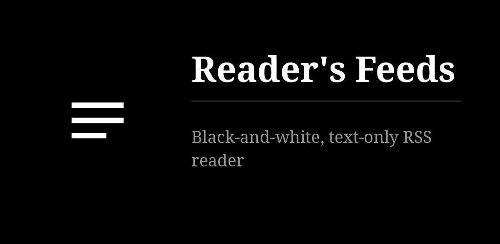
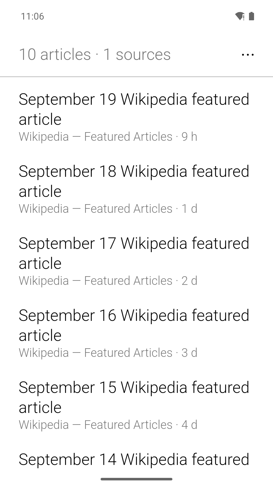
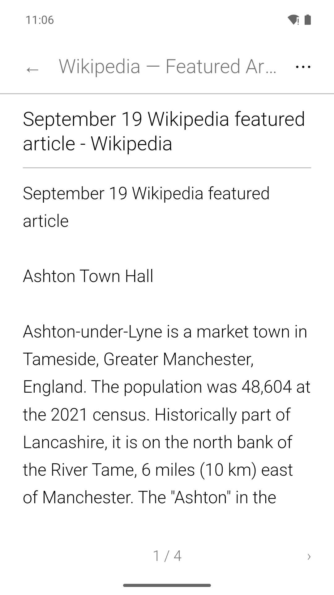

# Reader's Feeds

Your RSS and Atom sources as one plain list, articles read as pages cut at whole lines — no
scrolling, for e-ink. OPML, saved articles, paid Substacks. No icons, no colours, no account.
Fork of [Pluralis](https://github.com/funkypitt/pluralis), whose fetching, extraction and
pagination it keeps; in the family of [Reader's Launcher](https://github.com/funkypitt/readers-launcher).

## Key points

* One list: the latest articles, title in black, source and age in grey. Tap to read; the right
  half of the screen turns forward, the left half back.
* Long press an article to save it for later, open it in the browser or share it. The ⋯ menu
  leads to the sources, the saved articles, the settings, and flips white on black.
* Sources: any RSS or Atom feed. Tap the box to enable or disable one, its name for its own
  articles, long press for the rest.
* Paid Substack publications work after signing in; the cookie stays on the device.
* The list travels between devices by OPML import and export, plus a CSV of your Substacks
  with their cookies.
* E-ink: two colours, no animation. Settings › "pages" makes the lists turn pages instead of
  scrolling. Serif reading face; text size set from the settings or the reader's menu.
* Home-screen widget: the latest titles as a plain list, source under each; tap one to open it.

## Install

From the [F-Droid repo](https://funkypitt.github.io/fdroid-repo/) or the APK attached to a
release.

## Build

`flutter pub get && flutter build apk --release`

## Licence

GPL-3.0, as Pluralis.

## Crédits / Credits

Basé sur / Based on [Pluralis](https://github.com/funkypitt/pluralis) by Pierre Gallaz, GPL-3.0. Voir / see `NOTICE.md`.

© 2026 Pierre Gallaz. Développé avec [Claude Code](https://claude.com/claude-code) (Anthropic).
Licence GPL-3.0, voir `LICENSE`.

© 2026 Pierre Gallaz. Developed with [Claude Code](https://claude.com/claude-code) (Anthropic).
GPL-3.0 licence, see `LICENSE`.

## Captures d'écran

 
